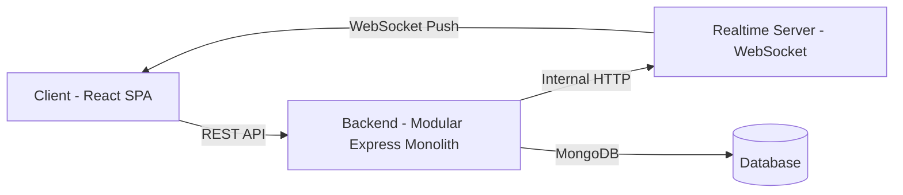

<p align="center">
  
  
  
</p>

# 🎮 TileRush — Real-Time Card Arena

**TileRush** is a competitive, real-time multiplayer card-claiming game where players race to seize territory on a dynamic grid. Claim cards, earn points, dodge traps, and dominate the leaderboard — all updating live via WebSockets.

---

### System Architecture

The project follows a **Modular Monolith** pattern on the backend, ensuring high maintainability and clear separation of concerns:



- **Feature Modules**: Logic grouped by feature (`auth`, `card`, `user`).
- **Shared Layer**: Centralized models, middleware, and common utilities.

---

## ⚙️ Configuration

Create `.env` files in the following directories:

### `backend/.env`

```env
PORT=5000
MONGO_URI=mongodb+srv://<user>:<password>@cluster.mongodb.net/<dbname>
JWT_SECRET=your-super-secret-jwt-key
NODE_ENV=development
MAX_CLAIMS=3
CLAIM_WINDOW_MINUTES=2
MAX_ACTIVE_CARDS=2
BASE_COOLDOWN_SECONDS=60
TRAP_EXTRA_COOLDOWN_SECONDS=300
INTERNAL_SECRET=your-internal-secret-key
REALTIME_SERVER_URL=http://localhost:3001
```


### `realtime-server/.env`

```env
PORT=3001
JWT_SECRET=your-super-secret-jwt-key
INTERNAL_SECRET=your-internal-secret-key
```

> ⚠️ `JWT_SECRET` and `INTERNAL_SECRET` must be **identical** across both services.

---

## 🤝 Contribution Guide

Contributions are warmly welcome! Please follow these steps:

1. **Fork** the repository
2. **Create** a new branch (`git checkout -b feature/your-feature-name`)
3. **Make** your changes and commit them (`git commit -m "Add: your feature description"`)
4. **Push** your changes (`git push origin feature/your-feature-name`)
5. **Create** a Pull Request

### Development Notes

- All three services (backend, client, realtime-server) must run simultaneously for full functionality
- Seed the database before first use: `cd backend && npx ts-node src/scripts/seedAllCards.ts`
- The backend auto-restarts via Nodemon when files change
- The client hot-reloads via Vite

---

## 📄 License

This project is licensed under the **MIT License**.

---

<p align="center">
  Built with ❤️ by <a href="https://niyaf.xyz">Mohammed Niyaf</a>
</p>
