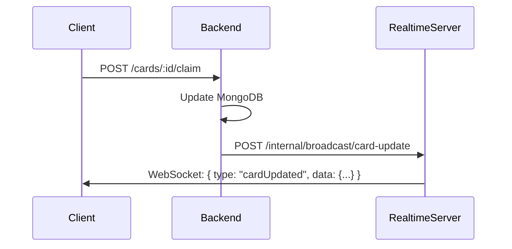

# ⚡ TileRush — Realtime Server

WebSocket server for TileRush that handles real-time broadcasting of game events to all connected clients. Built with **Express 5** and **ws** (WebSocket library).

---

## 📁 Project Structure

```
realtime-server/
├── src/
│   ├── routes/
│   │   └── broadcast.routes.ts  # Internal broadcast endpoints
│   ├── auth.ts                  # JWT token verification
│   ├── server.ts                # Express + WebSocket server entry
│   ├── types.ts                 # Shared TypeScript interfaces
│   └── websocket.ts             # WebSocket connection & broadcast logic
├── .env                         # Environment variables (do NOT commit)
├── package.json
└── tsconfig.json
```

---

## ⚙️ Environment Variables

Create a `.env` file in the `realtime-server/` directory:

```env
PORT=3001
JWT_SECRET=your-super-secret-jwt-key         # Must match backend JWT_SECRET
INTERNAL_SECRET=your-internal-secret-key     # Must match backend INTERNAL_SECRET
```

> ⚠️ `JWT_SECRET` and `INTERNAL_SECRET` **must** be identical to the values in the backend `.env`.

---

## 🚀 Getting Started

```bash
# Install dependencies
npm install

# Start development server
npm run dev
```

The server will start on **ws://localhost:3001**.

---

## 🔌 WebSocket Protocol

### Client Connection

Clients connect with a JWT token as a query parameter:

```
ws://localhost:3001?token=<JWT_TOKEN>
```

- **Authentication** — Token is verified on connection. Invalid tokens result in close code `4001`.
- **Single Connection** — One WebSocket per user. New connections replace existing ones.
- **Heartbeat** — Server pings every 30s. Unresponsive clients are terminated.
- **Keep-Alive** — Clients can send `{"type": "PING"}` to receive `{"type": "PONG"}`.

### Message Format

All messages are JSON with a `type` and `data` field:

```json
{
    "type": "cardUpdated",
    "data": { /* card object */ }
}
```

### Event Types

| Type | Direction | Description |
|------|-----------|-------------|
| `cardUpdated` | Server → Client | A card's ownership or status changed |
| `leaderboardUpdated` | Server → Client | A player's score changed |
| `PING` | Client → Server | Keep-alive heartbeat |
| `PONG` | Server → Client | Heartbeat response |

---

## 📡 Internal Broadcast API

The backend communicates with this server via internal HTTP endpoints. All requests require the `x-internal-secret` header.

| Method | Endpoint | Body | Broadcasts |
|--------|----------|------|------------|
| `POST` | `/internal/broadcast/card-update` | `{ card }` | `cardUpdated` to all clients |
| `POST` | `/internal/broadcast/card-expired` | `{ card }` | `cardExpired` to all clients |
| `POST` | `/internal/broadcast/leaderboard-update` | `{ leaderboardEntry }` | `leaderboardUpdated` to all clients |

### Security

- Requests are authenticated via the `x-internal-secret` header
- This secret is shared between the backend and realtime-server via environment variables
- These endpoints should **never** be exposed to the public internet

---

## 🏗️ Architecture



---

## 🛠️ Tech Stack

| Technology | Purpose |
|------------|---------|
| Express 5 | HTTP server for internal broadcast API |
| ws | WebSocket server implementation |
| jsonwebtoken | JWT verification for client connections |
| dotenv | Environment variable management |
| TypeScript | Type safety |
| Nodemon | Auto-restart during development |

---

## 📄 License

MIT
